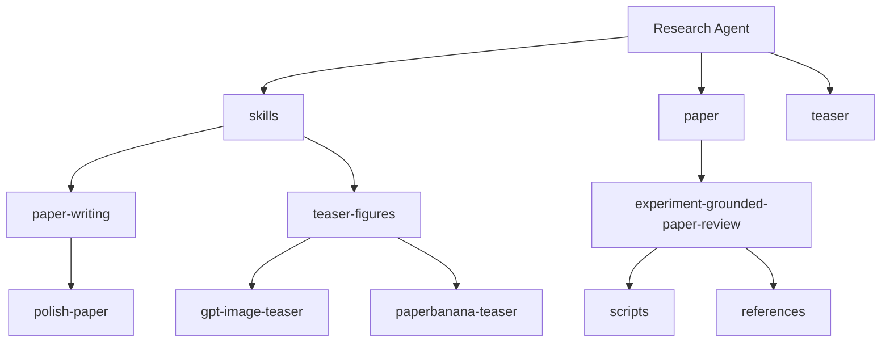

> Language / 语言: **[中文](./README.md)** | **English**

# Research Agent

A research-oriented skill repository designed to help users move faster on three recurring workflows:

- polishing research paper text
- designing prompts for academic teaser figures and method diagrams
- auditing consistency between paper claims, experimental results, and evidence

This repository is not a standalone executable app. It is a reusable `skill library` plus a set of helper scripts. The point is not to run one monolithic program, but to help you quickly pick the right skill or script when you need to revise a paper, design a figure prompt, or audit paper evidence.

## What This Repo Is For

If you often deal with tasks like these, this repository is built for you:

| Task | Where to go | Recommended entry |
| --- | --- | --- |
| Polish abstracts, introductions, methods, experiments, and rebuttals | `skills/paper-writing/` | `polish-paper` |
| Turn a paper method into a GPT Image prompt | `skills/teaser-figures/` | `gpt-image-teaser` |
| Build a fuller teaser prompt chain | `skills/teaser-figures/` | `paperbanana-teaser` |
| Audit paper claims, experiments, and numeric evidence | `paper/experiment-grounded-paper-review/` | `SKILL.md` + `scripts/` |

## One-Minute Mental Model



You can think of the repository as three layers:

1. `skills/` is the recommended daily entry point
2. `paper/` and `teaser/` keep compatibility paths for older references and scripts
3. `paper/experiment-grounded-paper-review/` provides a heavier paper-audit workflow

## Quick Install

### Option 1: Clone the full repository

Best if you want to browse, modify, and choose skills locally.

```bash
git clone git@github.com:PaulClawX/research-agent.git
cd research-agent
```

### Option 2: Copy only the skill you need

Best if you already know which capability you want.

Copy the paper-polishing skill:

```bash
cp -R skills/paper-writing/polish-paper /path/to/your/skills/
```

Copy the GPT Image teaser skill:

```bash
cp -R skills/teaser-figures/gpt-image-teaser /path/to/your/skills/
```

Copy the PaperBanana teaser skill:

```bash
cp -R skills/teaser-figures/paperbanana-teaser /path/to/your/skills/
```

## Get Started in Three Steps

### Step 1: Choose the right entry point

Decide what your output is:

- If the output is text, go to `skills/paper-writing`
- If the output is a figure prompt, go to `skills/teaser-figures`
- If the output is an audit or evidence check, go to `paper/experiment-grounded-paper-review`

### Step 2: Read the core instructions

Each skill keeps its main usage guide in `SKILL.md`. It usually tells you:

- when to use it
- what input to prepare
- what the default workflow is
- what output modes are available

### Step 3: Reuse templates or scripts directly

If you do not want to start from scratch:

- For writing and teaser-figure tasks, go directly to `references/`
- For paper-audit tasks, start with `scripts/` and `references/`

## Recommended Usage Paths

### Path A: Paper polishing

1. Open [skills/paper-writing/polish-paper/SKILL.md](./skills/paper-writing/polish-paper/SKILL.md)
2. Decide whether you are revising an abstract, intro, method, experiment section, or rebuttal
3. Copy the right template from [skills/paper-writing/polish-paper/references/prompt-templates.md](./skills/paper-writing/polish-paper/references/prompt-templates.md)
4. If you want the review-and-polish mode, also read [skills/paper-writing/polish-paper/references/review-and-sciwrite.md](./skills/paper-writing/polish-paper/references/review-and-sciwrite.md)

### Path B: Fast teaser prompt generation

1. Open [skills/teaser-figures/gpt-image-teaser/SKILL.md](./skills/teaser-figures/gpt-image-teaser/SKILL.md)
2. Prepare the paper topic, core problem, method, caption, or a method paragraph
3. Use [skills/teaser-figures/gpt-image-teaser/references/gpt-image-prompts.md](./skills/teaser-figures/gpt-image-teaser/references/gpt-image-prompts.md) to choose a `Figure Brief` or the main prompt
4. Generate a first-pass image, then refine it with the revision prompt

### Path C: Full teaser workflow

1. Open [skills/teaser-figures/paperbanana-teaser/SKILL.md](./skills/teaser-figures/paperbanana-teaser/SKILL.md)
2. Organize inputs in planner -> stylist -> visualizer -> critic order
3. Copy the corresponding stage templates from [skills/teaser-figures/paperbanana-teaser/references/prompt-templates.md](./skills/teaser-figures/paperbanana-teaser/references/prompt-templates.md)

### Path D: Paper evidence audit

1. Open [paper/experiment-grounded-paper-review/SKILL.md](./paper/experiment-grounded-paper-review/SKILL.md)
2. Read the schemas and rule files under [paper/experiment-grounded-paper-review/references](./paper/experiment-grounded-paper-review/references)
3. Run the extraction, alignment, and audit scripts as needed
4. Starting from `run_paper_audit.py` or `extract_numeric_evidence.py` is usually the fastest route

## Repository Layout

```text
.
├── .gitignore
├── README.md
├── README.en.md
├── docs/
│   ├── quickstart.md
│   └── repo-map.md
├── examples/
│   ├── paper-polish.md
│   └── teaser-prompts.md
├── skills/
│   ├── README.md
│   ├── paper-writing/
│   │   ├── README.md
│   │   └── polish-paper/
│   └── teaser-figures/
│       ├── README.md
│       ├── gpt-image-teaser/
│       └── paperbanana-teaser/
├── paper/
│   ├── experiment-grounded-paper-review/
│   ├── polish-paper/
│   └── polish-paper-bilingual/
└── teaser/
    ├── gpt-image-teaser/
    └── paperbanana-teaser/
```

## What Each Directory Is For

### `skills/`

This is the best entry point for new users. It is cleaner and easier to navigate.

### `paper/`

This area contains both compatibility mirrors and the heavier paper-audit tooling.

Key directories:

- `paper/experiment-grounded-paper-review/`
- `paper/polish-paper/`
- `paper/polish-paper-bilingual/`

### `teaser/`

This keeps compatibility paths for teaser-related skill mirrors.

## What Lives Inside a Skill Directory

Most skills follow the same structure so they are easy to move and reuse:

- `SKILL.md`
  Defines the purpose, input requirements, workflow, and output modes
- `agents/openai.yaml`
  Defines the display name, summary, and default prompt for agent use
- `references/`
  Stores reusable templates and reference content

Heavier audit-oriented directories may also include:

- `scripts/`
  For automated extraction, alignment, checking, and audit workflows

## What to Read First

If this is your first time in the repository, read in this order:

1. [README.md](./README.md)
2. [docs/quickstart.md](./docs/quickstart.md)
3. [skills/README.md](./skills/README.md)
4. The target skill's `SKILL.md`
5. The target skill's `references/` or `scripts/`

## Additional Documents

- [docs/quickstart.md](./docs/quickstart.md): 5-minute quick start
- [docs/repo-map.md](./docs/repo-map.md): repository map and design notes
- [examples/paper-polish.md](./examples/paper-polish.md): paper-polishing examples
- [examples/teaser-prompts.md](./examples/teaser-prompts.md): teaser prompt examples

## Design Goals

- A new user should know where to start immediately
- Each skill should have clear scope boundaries
- Templates and scripts should be directly reusable
- Compatibility directories should remain available so older paths do not break immediately
- New skills should still fit into a clear navigation model
