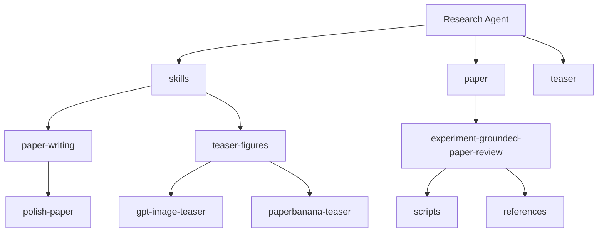

> Language / 语言: **中文** | **[English](./README.en.md)**

# Research Agent

一个面向研究场景的技能仓库，用来帮助用户更快地完成三类高频工作：

- 论文文字打磨
- 学术 teaser 图与方法图 prompt 设计
- 论文 claim、实验结果与证据的一致性审计

这个仓库不是一个可执行应用，而是一套可复用的 `skill library` 加辅助脚本集合。它的重点不是“运行一个单体程序”，而是让你在需要改论文、做图、审计论文证据时，能快速挑到合适的 skill 或脚本，直接开始工作。

## 这个 Repo 是做什么的

如果你经常遇到下面这些任务，这个仓库就是给你准备的：

| 任务 | 去哪里 | 推荐入口 |
| --- | --- | --- |
| 润色论文摘要、引言、方法、实验、rebuttal | `skills/paper-writing/` | `polish-paper` |
| 把论文方法整理成 GPT Image prompt | `skills/teaser-figures/` | `gpt-image-teaser` |
| 做更完整的 teaser prompt chain | `skills/teaser-figures/` | `paperbanana-teaser` |
| 审计论文 claim、实验与数值证据 | `paper/experiment-grounded-paper-review/` | `SKILL.md` + `scripts/` |

## 一分钟理解结构



你可以把它理解成三层：

1. `skills/` 是推荐入口，面向日常使用
2. `paper/` 和 `teaser/` 保留兼容目录，供旧路径或脚本继续引用
3. `paper/experiment-grounded-paper-review/` 提供更重型的论文审计能力

## 快速安装

### 方式一：直接克隆仓库

适合先浏览、修改、挑选 skill。

```bash
git clone git@github.com:PaulClawX/research-agent.git
cd research-agent
```

### 方式二：只拷贝你需要的 skill

适合已经知道自己要用哪个能力。

拷贝论文润色 skill：

```bash
cp -R skills/paper-writing/polish-paper /path/to/your/skills/
```

拷贝 GPT Image teaser skill：

```bash
cp -R skills/teaser-figures/gpt-image-teaser /path/to/your/skills/
```

拷贝 PaperBanana teaser skill：

```bash
cp -R skills/teaser-figures/paperbanana-teaser /path/to/your/skills/
```

## 三步上手

### 第一步：选对入口

先判断你的产出是什么：

- 如果你的产出是“文字”，走 `skills/paper-writing`
- 如果你的产出是“图的 prompt”，走 `skills/teaser-figures`
- 如果你的产出是“审计/核对结果”，走 `paper/experiment-grounded-paper-review`

### 第二步：读核心说明

每个 skill 的核心使用说明都在 `SKILL.md` 里，通常会告诉你：

- 什么时候用
- 输入要准备什么
- 默认工作流是什么
- 输出模式有哪些

### 第三步：直接复用模板或脚本

如果你不想从空白开始：

- 文字和 teaser 图任务，直接去对应目录下的 `references/`
- 论文审计任务，优先看 `scripts/` 和 `references/`

## 推荐使用路径

### 路线 A：论文润色

1. 打开 [skills/paper-writing/polish-paper/SKILL.md](./skills/paper-writing/polish-paper/SKILL.md)
2. 确认你要润色的部分是 abstract、intro、method、experiment 还是 rebuttal
3. 去 [skills/paper-writing/polish-paper/references/prompt-templates.md](./skills/paper-writing/polish-paper/references/prompt-templates.md) 复制对应模板
4. 如果你要走 review-and-polish 模式，再看 [skills/paper-writing/polish-paper/references/review-and-sciwrite.md](./skills/paper-writing/polish-paper/references/review-and-sciwrite.md)

### 路线 B：快速生成 teaser prompt

1. 打开 [skills/teaser-figures/gpt-image-teaser/SKILL.md](./skills/teaser-figures/gpt-image-teaser/SKILL.md)
2. 准备论文主题、核心问题、方法、caption 或 method 段落
3. 去 [skills/teaser-figures/gpt-image-teaser/references/gpt-image-prompts.md](./skills/teaser-figures/gpt-image-teaser/references/gpt-image-prompts.md) 选 `Figure Brief` 或主 prompt
4. 先出第一版图，再用 revision prompt 精修

### 路线 C：做完整 teaser 工作流

1. 打开 [skills/teaser-figures/paperbanana-teaser/SKILL.md](./skills/teaser-figures/paperbanana-teaser/SKILL.md)
2. 按 planner -> stylist -> visualizer -> critic 的顺序组织输入
3. 从 [skills/teaser-figures/paperbanana-teaser/references/prompt-templates.md](./skills/teaser-figures/paperbanana-teaser/references/prompt-templates.md) 复制对应阶段模板

### 路线 D：做论文证据审计

1. 打开 [paper/experiment-grounded-paper-review/SKILL.md](./paper/experiment-grounded-paper-review/SKILL.md)
2. 看 [paper/experiment-grounded-paper-review/references](./paper/experiment-grounded-paper-review/references) 下的 schema 和规则说明
3. 按需要运行 `scripts/` 里的抽取、对齐和审计脚本
4. 从 `run_paper_audit.py` 或 `extract_numeric_evidence.py` 开始通常最直接

## 仓库结构

```text
.
├── .gitignore
├── README.md
├── README.en.md
├── docs/
│   ├── quickstart.md
│   └── repo-map.md
├── examples/
│   ├── paper-polish.md
│   └── teaser-prompts.md
├── skills/
│   ├── README.md
│   ├── paper-writing/
│   │   ├── README.md
│   │   └── polish-paper/
│   └── teaser-figures/
│       ├── README.md
│       ├── gpt-image-teaser/
│       └── paperbanana-teaser/
├── paper/
│   ├── experiment-grounded-paper-review/
│   ├── polish-paper/
│   └── polish-paper-bilingual/
└── teaser/
    ├── gpt-image-teaser/
    └── paperbanana-teaser/
```

## 每个目录是干什么的

### `skills/`

推荐新用户从这里进入。这里的内容更干净，导航更明确。

### `paper/`

这里既有兼容旧路径的 mirror，也有更偏“重工具链”的论文审计能力。

重点目录：

- `paper/experiment-grounded-paper-review/`
- `paper/polish-paper/`
- `paper/polish-paper-bilingual/`

### `teaser/`

保留旧路径兼容，主要对应 teaser 类技能的镜像目录。

## 每个 Skill 目录里有什么

大多数 skill 都遵循同一套结构，方便迁移和复用：

- `SKILL.md`
  定义这个 skill 的用途、输入要求、工作流和输出模式
- `agents/openai.yaml`
  给 agent 使用的展示名、简介和默认 prompt
- `references/`
  放可以直接复制的模板和参考内容

更重型的审计类目录还会多出：

- `scripts/`
  放自动抽取、对齐、核对和审计脚本

## 你应该先看哪些文件

如果你是第一次进这个仓库，建议按这个顺序看：

1. [README.md](./README.md)
2. [docs/quickstart.md](./docs/quickstart.md)
3. [skills/README.md](./skills/README.md)
4. 目标 skill 的 `SKILL.md`
5. 目标 skill 的 `references/` 或 `scripts/`

## 补充文档

- [docs/quickstart.md](./docs/quickstart.md): 5 分钟快速上手
- [docs/repo-map.md](./docs/repo-map.md): 仓库导航与设计说明
- [examples/paper-polish.md](./examples/paper-polish.md): 论文润色示例
- [examples/teaser-prompts.md](./examples/teaser-prompts.md): teaser prompt 示例

## 设计目标

- 新用户第一次打开仓库就知道从哪里开始
- skill 的职责边界清楚，不用猜
- 模板和脚本可直接复用，提高使用效率
- 保留兼容目录，避免旧路径立即失效
- 后续新增 skill 时，仍然能维持清晰导航
