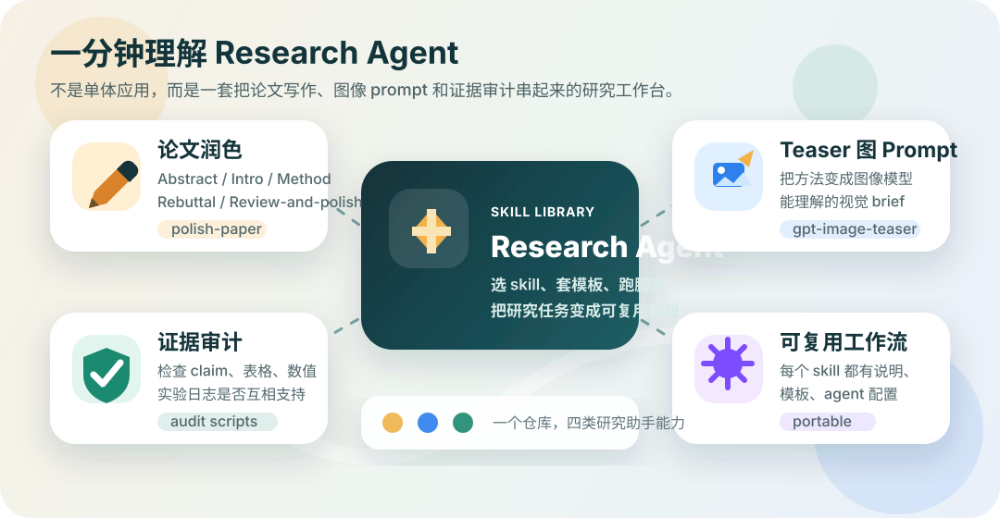

# Repo Map

这个仓库采用“推荐入口 -> 兼容镜像 -> 重型工具目录”的组合结构。

## 功能地图

这张图强调“这个项目能帮你做什么”，而不是让用户先记目录层级。目录结构只作为导航细节存在：`skills/` 是推荐入口，`paper/` 和 `teaser/` 是兼容路径，`docs/` 和 `examples/` 负责快速上手。

## 设计思路

### 1. `skills/` 作为推荐入口

这里面是当前最适合新用户直接进入的结构。

### 2. `docs/` 负责解释

这里放上手文档、结构说明、使用建议。

### 3. `examples/` 负责示例

这里放“怎么用”的短例子，帮助用户避免只看概念不知如何下手。

### 4. `paper/` 和 `teaser/` 保留兼容路径

这些目录主要用于兼容已有 agent、脚本或历史引用，避免旧路径失效。

### 5. `paper/experiment-grounded-paper-review/` 放重型工具

这里不只是 prompt 模板，还包含脚本、schema、规则文件，适合做更系统的论文核对与证据审计。

### 6. `skills/` 里的每个 skill 负责一个清晰能力单元

每个 skill 都是一个可复用的小单元，具备：

- 独立说明
- agent 配置
- prompt 模板

## 什么时候该新增一个 Skill

只有在下面条件成立时才建议新增：

- 任务类型和现有 skill 明显不同
- 输入模式、工作流或输出模式有稳定差异
- 复用价值足够高，不是一次性的 prompt

如果只是现有 skill 的一个小变体，优先在 `references/` 里新增模板，而不是再开一个新 skill。
